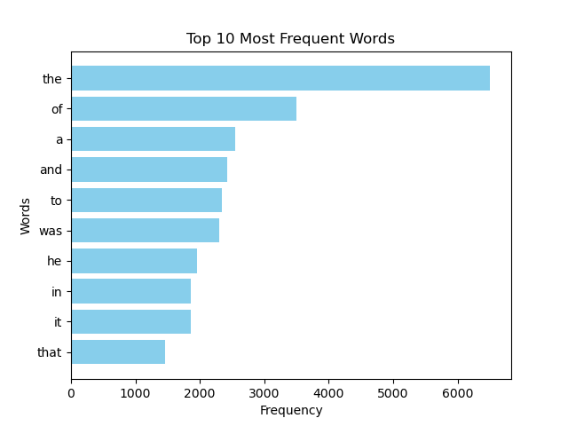
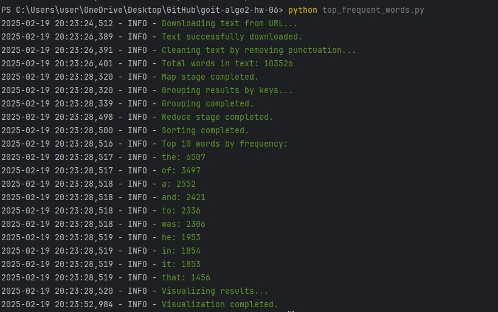

# HW-6 | 

**Introduction**:

Fundamentals of Parallel Computing and the MapReduce Model"
Welcome! 🧠

In today's world of modern information technology, processing large 
volumes of data requires efficient and fast methods. Your task is to 
write a Python script that applies the MapReduce paradigm to analyze
word frequency in a text and visualize the results.

Completing this homework will help you develop skills in efficiently 
handling large-scale files. It will also provide hands-on experience 
in leveraging Python’s parallel computing capabilities to accelerate 
code execution.

## **Task Descriptions**
---

Write a Python script that downloads text from a given URL, analyzes word
frequency using the MapReduce paradigm, and visualizes the most frequently
used words.

### **Step-by-Step Instructions**

1. **Import necessary modules** (e.g., `matplotlib` and others).
2. **Use the provided MapReduce implementation** from the reference notes.
3. Create a function `visualize_top_words` to visualize the results.
4. In the main code block:
   - Fetch text from the URL.
   - Apply the MapReduce paradigm.
   - Visualize the results.

👉 **For example**, for the top 10 most frequently used words, the graph 
could look like this:

### **Acceptance Criteria**

- Code fetches text from the given URL.
- Code performs word frequency analysis using MapReduce.
- Visualization displays the top words by frequency.
- Code uses multithreading for parallel processing.
- Code is readable and adheres to PEP 8 standards.

# TASK RESULTS

#### Visualized results
